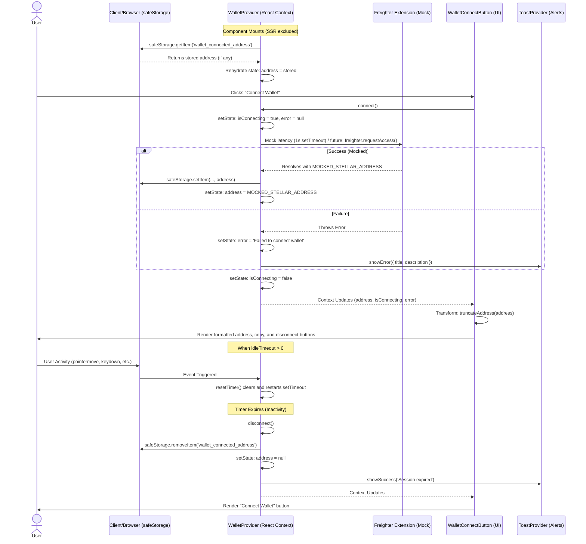

# Wallet Data Flow

This document provides a visual overview of how the Stellar wallet session is loaded, transformed, and rendered within the TalentTrust frontend. It maps the data flow from initialization and connection (fetch) through processing (transform) to UI presentation (render).

## Mermaid Sequence Diagram

The following sequence diagram illustrates the lifecycle of the wallet state, including client-side rehydration, the mock connection sequence, rendering updates, and the idle inactivity disconnect safeguard.



## ASCII Flow Diagram

For environments where Mermaid is not supported, the following ASCII diagram maps the `Fetch -> Transform -> Render` pipeline.

```text
[LocalStorage]                             [User Input]
      |                                         |
      v                                         v
+-------------------------------------------------------------+
|                   WalletProvider (Context)                  |
|                                                             |
|  [Fetch Phase]                                              |
|  1. Rehydrate address from safeStorage on client mount.     |
|  2. connect() -> simulates 1s latency -> sets state/storage.|
|  3. Activity listeners (pointermove, keydown, mousedown,    |
|     touchstart, visibilitychange) reset inactivity timer.   |
|  4. Timer expiry triggers disconnect(), clears state and    |
|     storage, and fires "Session expired" toast.             |
+-------------------------------+-----------------------------+
                                |
                                | (Context State: address, isConnecting, error)
                                v
+-------------------------------------------------------------+
|                WalletConnectButton (UI)                     |
|                                                             |
|  [Transform Phase]                                          |
|  1. truncateAddress(address) -> transforms raw public key   |
|     (e.g., "GAAQ...DZ7H") for UI display.                   |
|                                                             |
|  [Render Phase]                                             |
|  1. If isConnecting -> renders "Connecting..." loader.      |
|  2. If error -> renders inline "Connection Error" + Retry.  |
|  3. If address -> renders formatted address string, Copy    |
|     to clipboard button, and Disconnect button.             |
+-------------------------------------------------------------+
```

## Detailed Flow Breakdown

### 1. Fetch & Initialization Phase
- **Rehydration:** The `WalletProvider` ensures the wallet remains connected across page refreshes by reading `wallet_connected_address` from `safeStorage` when the component mounts on the client (bypassing SSR).
- **Connection Mock:** The `connect()` function currently simulates network latency with a 1-second timeout and injects a hard-coded `MOCKED_STELLAR_ADDRESS`. In the future, this phase will fetch the address via `window.freighter.requestAccess()`.
- **Inactivity Monitoring:** If `idleTimeout` is configured, `window` event listeners monitor user activity to continually reset a disconnect timer.

### 2. Transform Phase
- **Address Formatting:** The raw Stellar public key (a 56-character string) is passed through `truncateAddress(address)` in the `WalletConnectButton` to yield a visually concise string (e.g., first and last few characters) suitable for header display.
- **Clipboard Preparation:** The `useCopyToClipboard` hook wraps the address so users can copy the full raw string, managing transient state (like showing a checkmark for 2 seconds upon success).

### 3. Render Phase
The UI acts purely as a consumer of the provider's state:
- **`isConnecting` (true):** Disables the button and shows a spinning loader.
- **`error` (present):** Renders an inline error message and a "Retry" button. Additionally, the `WalletProvider` itself triggers an assertive ARIA-live toast notification for accessibility.
- **`address` (present):** Renders the truncated address alongside interactive copy and disconnect controls. 
