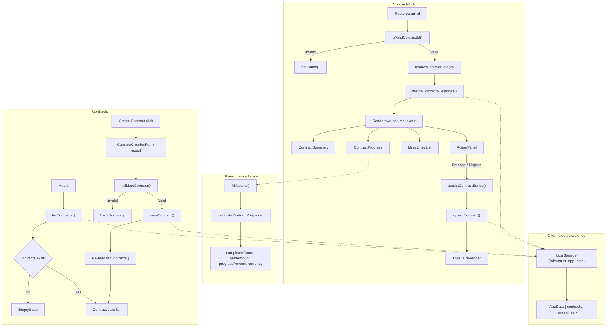

# Contracts Data-Flow Diagram

The goal of this document is to help new contributors understand how contracts data is fetched, transformed, and rendered without needing to trace through multiple components and hooks in the codebase.

## Flow Notes

### Contracts List (`/contracts`)

- **Fetch**: `listContracts()` (from `src/lib/repository.ts`) reads `talenttrust_app_data` from `localStorage`. SSR-safe — returns an empty array when `window` is undefined or the store is corrupt.
- **Render**: Shows `EmptyState` when the list is empty, otherwise renders a card list with contract name, status, and creation date.
- **Create**: The `ContractCreationForm` modal accepts user input, runs `validateContract()` (pure validation, from `src/lib/validateContract.ts`) for field errors, then calls `saveContract()` to persist. The list is refreshed by re-invoking `listContracts()`.

A secondary inline form (`CreateContractForm`, in `src/components/contracts/`) follows the same validation and persistence pattern but renders in-page instead of in a modal.

### Contract Detail (`/contracts/[id]`)

- **Route validation**: `isValidContractId(id)` (from `src/lib/validateContractId.ts`) guards the route — rejects empty, oversized, or special-character IDs by calling Next.js `notFound()`.
- **Fetch**: Two sources — `resolveContractData(id)` (async, from `src/lib/contractResolver.ts`, a typed mock that returns `ContractData`) and `listMilestonesByContract(id)` (sync, from the repository).
- **Transform**: `mergeContractMilestones()` de-duplicates by milestone `id`, with persisted records taking precedence over resolver records. `buildPersistedContract()` narrows `ContractData` into the repository `Contract` shape for status writes.
- **Render**: Left column — `ContractSummary` (metadata, parties), `ContractProgress` (escrow bar + fund cards), `MilestonesList` (scrollable roster). Right column — `ActionPanel` (context-aware buttons). Each component is wrapped in `SafeBoundary` for render-error isolation. Skeleton placeholders display during loading.
- **State updates**: `persistContractStatus()` writes status transitions (Complete/Dispute) to the repository via `upsertContract()`, updates local state optimistically, and surfaces a toast. `ContractStatusAnnouncer` (with `aria-live`) announces transitions to screen readers.

### Shared Derived State

- `useContractProgress(milestones)` wraps `calculateContractProgress()`, deriving `completedCount`, `totalCount`, `paidAmount`, `outstandingAmount`, `progressPercent`, and `currency` from the milestone array. Memoized and shared across `ContractProgress` and any consumer that needs escrow math.

### Persistence Layer

All read/write operations flow through `src/lib/repository.ts`, which serializes the full app state under the single `localStorage` key `talenttrust_app_data`. The layer is synchronous, SSR-safe, and non-mutating (callers own their data). See `docs/data-model.md` for the full API reference.

## Key Data Types

| Type | Source | Fields |
|---|---|---|
| `ContractData` | `src/lib/contractResolver.ts` | `id`, `name`, `status`, `parties`, `totalValue`, `currency`, `createdAt`, `milestones` |
| `Contract` | `src/types/domain.ts` | `contractName`, `parties`, `totalValue`, `currency`, `status`, `createdAt`, `milestoneCount` |
| `Milestone` | `src/components/MilestonesList.tsx` | `id`, `title`, `status`, `payout`, `currency`, `dueDate?`, `contractId?` |
| `ContractProgressMetrics` | `src/hooks/useContractProgress.ts` | `completedCount`, `totalCount`, `paidAmount`, `outstandingAmount`, `progressPercent`, `currency` |
