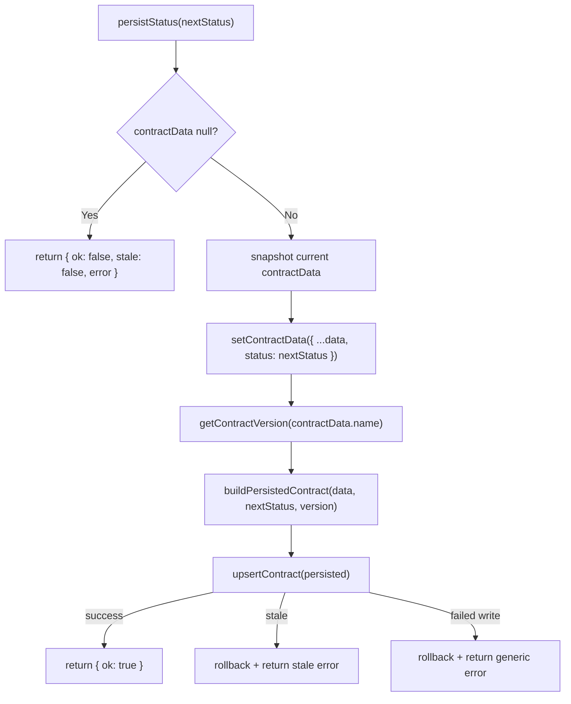

# Contracts Hooks

Usage reference for the custom React hooks that power the contracts surfaces
(`/contracts` and `/contracts/[id]`). Each entry documents the **inputs**, the
**returns**, and the **states** the hook can be observed in, with copy-pasteable
examples taken from the way the app wires them today.

> Scope: hooks that own contracts-specific logic. Generic hooks that contracts
> screens merely consume are cross-linked in
> [Related hooks used on contracts surfaces](#related-hooks-used-on-contracts-surfaces).

---

## At a glance

| Hook | Source | Input | Returns | Pure? |
|---|---|---|---|---|
| [`useContractProgress`](#usecontractprogress) | `src/hooks/useContractProgress.ts` | `Milestone[]` | `ContractProgressMetrics` | Yes — derived state only |
| [`calculateContractProgress`](#calculatecontractprogress--the-non-react-entry-point) | `src/hooks/useContractProgress.ts` | `Milestone[]` | `ContractProgressMetrics` | Yes — plain function, no React |
| [`useOptimisticContractStatus`](#useoptimisticcontractstatus) | `src/hooks/useOptimisticContractStatus.ts` | contract data + state setter + mapper | `(nextStatus) => PersistResult` | No — writes to the repository |

---

## `useContractProgress`

Derives escrow progress metrics from a milestone array. It is the single source
of truth for the paid/outstanding split so `ContractProgress`, a detail header,
or a contracts-list summary can never drift apart.

### Import

```ts
import {
  useContractProgress,
  calculateContractProgress,
  type ContractProgressMetrics,
} from '@/hooks/useContractProgress';
```

### Signature

```ts
function useContractProgress(milestones: Milestone[]): ContractProgressMetrics;
```

### Inputs

| Parameter | Type | Required | Description |
|---|---|---|---|
| `milestones` | `Milestone[]` | ✅ | Milestones belonging to one contract. An empty array is valid and returns the zero state. A nullish value is tolerated and also returns the zero state. |

`Milestone` is defined in `src/components/MilestonesList.tsx`:

```ts
type Milestone = {
  id: string;
  title: string;
  status: StatusType;   // 'Active' | 'Completed' | 'Disputed' | 'Pending' | 'Paid'
  payout: number;
  currency: string;
  dueDate?: string;
  contractId?: string;
};
```

### Returns

Returns a `ContractProgressMetrics` object:

| Property | Type | Description |
|---|---|---|
| `completedCount` | `number` | Milestones whose `status` is `'Completed'` **or** `'Paid'`. |
| `totalCount` | `number` | `milestones.length`. |
| `paidAmount` | `number` | Sum of `payout` across completed/paid milestones. |
| `outstandingAmount` | `number` | Sum of `payout` across every other status (`'Pending'`, `'Active'`, `'Disputed'`). |
| `progressPercent` | `number` | `Math.round((completedCount / totalCount) * 100)`, `0` when there are no milestones. |
| `currency` | `string` | `milestones[0].currency`, falling back to `'USD'` for an empty array. |

### States

| State | Trigger | Returned metrics |
|---|---|---|
| **Empty** | `[]` (or nullish) | `{ completedCount: 0, totalCount: 0, paidAmount: 0, outstandingAmount: 0, progressPercent: 0, currency: 'USD' }` |
| **Not started** | No milestone is `Completed`/`Paid` | `completedCount: 0`, `progressPercent: 0`, everything in `outstandingAmount` |
| **In progress** | Some completed | Split across `paidAmount` / `outstandingAmount`; `progressPercent` rounded (e.g. 1 of 3 → `33`) |
| **Complete** | Every milestone is `Completed`/`Paid` | `outstandingAmount: 0`, `progressPercent: 100` |

There is no loading or error state — the hook is a synchronous derivation and
never throws for well-formed `Milestone` objects.

### Usage — render an escrow panel

```tsx
'use client';

import { useContractProgress } from '@/hooks/useContractProgress';
import { usePreferences } from '@/lib/preferences';
import type { Milestone } from '@/components/MilestonesList';

export function EscrowPanel({ milestones }: { milestones: Milestone[] }) {
  const { formatAmount } = usePreferences();
  const {
    completedCount,
    totalCount,
    paidAmount,
    outstandingAmount,
    progressPercent,
    currency,
  } = useContractProgress(milestones);

  // Empty state: skip the progress bar, an indeterminate "0 of 0" reads as broken.
  if (totalCount === 0) {
    return <p>No milestones yet</p>;
  }

  return (
    <section aria-labelledby="escrow-title">
      <h2 id="escrow-title">Escrow Progress</h2>
      <p>
        {completedCount} / {totalCount} milestones complete
      </p>
      <div
        role="progressbar"
        aria-valuenow={progressPercent}
        aria-valuemin={0}
        aria-valuemax={100}
      />
      <dl>
        <dt>Paid</dt>
        <dd>{formatAmount(paidAmount, currency)}</dd>
        <dt>Outstanding</dt>
        <dd>{formatAmount(outstandingAmount, currency)}</dd>
      </dl>
    </section>
  );
}
```

### Usage — a compact list summary

```tsx
'use client';

import { useContractProgress } from '@/hooks/useContractProgress';
import type { Milestone } from '@/components/MilestonesList';

export function ContractProgressPill({ milestones }: { milestones: Milestone[] }) {
  const { progressPercent, completedCount, totalCount } = useContractProgress(milestones);

  return (
    <span aria-label={`${completedCount} of ${totalCount} milestones complete`}>
      {progressPercent}%
    </span>
  );
}
```

### `calculateContractProgress` — the non-React entry point

Use the plain function wherever hooks are unavailable: server code, repository
helpers, exports, sorting comparators, or tests.

```ts
import { calculateContractProgress } from '@/hooks/useContractProgress';

// Sort contracts by how far along their escrow is, most complete first.
const byProgress = [...contractMilestoneGroups].sort(
  (a, b) =>
    calculateContractProgress(b.milestones).progressPercent -
    calculateContractProgress(a.milestones).progressPercent,
);

const { paidAmount, outstandingAmount } = calculateContractProgress(milestones);
```

### Memoization contract

`useContractProgress` wraps `calculateContractProgress` in `useMemo` keyed on the
**array reference**, so:

- A stable reference across renders returns the *same object identity* — safe to
  pass into `React.memo` children or a `useEffect` dependency list.
- A freshly allocated array on every render defeats memoization. Filter or merge
  upstream and memoize there:

```tsx
// ❌ new array identity on every render — recomputes each time
const metrics = useContractProgress(milestones.filter((m) => m.status !== 'Disputed'));

// ✅ stable identity while inputs are unchanged
const visible = useMemo(
  () => milestones.filter((m) => m.status !== 'Disputed'),
  [milestones],
);
const metrics = useContractProgress(visible);
```

No defensive copy is made, so an upstream bug that mutates the array in place
stays visible rather than being silently hidden by the hook.

### Gotchas

- `'Paid'` and `'Completed'` are **both** counted as complete. A milestone marked
  `'Disputed'` still counts toward `outstandingAmount`.
- `currency` is read from the first milestone only. Mixed-currency milestones are
  detected separately by `findCurrencyMismatches` (`src/lib/currencyMismatch.ts`)
  and surfaced by `MilestonesList` — this hook does not convert currencies.
- `progressPercent` is milestone-count based, not value based. A contract can sit
  at `50%` while most of the money is still outstanding.

### Tested by

`src/hooks/__tests__/useContractProgress.test.ts` and
`src/hooks/__tests__/ContractsHooks.examples.test.tsx`.

---

## `useOptimisticContractStatus`

Applies a contract status transition to local state immediately, persists it
through the repository, and rolls the optimistic change back when the write is
rejected. Used by the contract detail page for the Release Funds and Dispute
actions.

### Import

```ts
import {
  useOptimisticContractStatus,
  type BuildPersistedContract,
  type PersistResult,
} from '@/hooks/useOptimisticContractStatus';
```

### Signature

```ts
function useOptimisticContractStatus(
  contractData: ContractData | null,
  setContractData: React.Dispatch<React.SetStateAction<ContractData | null>>,
  buildPersistedContract: BuildPersistedContract,
): (nextStatus: ContractData['status']) => PersistResult;
```

### Inputs

| Parameter | Type | Required | Description |
|---|---|---|---|
| `contractData` | `ContractData \| null` | ✅ | The contract currently rendered. `null` while loading or after a failed fetch — the returned function then short-circuits with an error result. |
| `setContractData` | `React.Dispatch<React.SetStateAction<ContractData \| null>>` | ✅ | The `useState` setter that owns `contractData`. Called once for the optimistic update, and a second time to roll back on failure. |
| `buildPersistedContract` | `BuildPersistedContract` | ✅ | Maps the detail-page `ContractData` into the repository `Contract` shape. Wrap it in `useCallback` so the returned `persistStatus` identity stays stable. |

`ContractData` (`src/lib/contractResolver.ts`) carries
`id`, `name`, `status`, `parties`, `totalValue`, `currency`, `createdAt`, and
`milestones`. Its `status` union is `'Active' | 'Completed' | 'Disputed' | 'Pending'`.

### `BuildPersistedContract`

```ts
type BuildPersistedContract = (
  data: ContractData,
  status: ContractData['status'],
  version: number,
) => Contract;
```

| Argument | Description |
|---|---|
| `data` | The **pre-transition** contract data, so the mapper can read unchanged fields. |
| `status` | The status being written. Use this — not `data.status` — for the persisted record. |
| `version` | Read by the hook from `getContractVersion(contractData.name)` and threaded through so the repository's stale-overwrite guard compares against the right baseline. Copy it into the returned `Contract` verbatim. |

### Returns

A stable `persistStatus(nextStatus)` function that runs **synchronously** and
returns a `PersistResult` discriminated union:

```ts
type PersistResult =
  | { ok: true }
  | { ok: false; stale: boolean; error: string };
```

| Field | Type | Description |
|---|---|---|
| `ok` | `boolean` | Discriminant. `true` means the write landed and the optimistic update stands. |
| `stale` | `boolean` | Only on failures. `true` when the repository rejected the write because a newer version exists (another tab/session). |
| `error` | `string` | Only on failures. User-ready copy, safe to render in a banner and a toast. |

### States

| State | Condition | Result | Side effects |
|---|---|---|---|
| **Unavailable** | `contractData === null` | `{ ok: false, stale: false, error: 'Contract details are unavailable, so the status could not be updated.' }` | None — `setContractData` and `upsertContract` are never called. |
| **Success** | `upsertContract` returns `{ success: true }` | `{ ok: true }` | `setContractData` called **once** with the new status. |
| **Stale** | `upsertContract` returns `{ success: false, stale: true }` | `{ ok: false, stale: true, error: 'This contract was updated in another session. Please reload and try again.' }` | `setContractData` called **twice** — optimistic, then rollback to the previous snapshot. |
| **Write failure** | `upsertContract` returns `{ success: false, stale: false }` | `{ ok: false, stale: false, error: 'The contract status could not be persisted. Please try again.' }` | `setContractData` called **twice** — optimistic, then rollback. |

There is no in-flight/pending state: the repository is synchronous
`localStorage`. Owning components track their own `isPersisting` flag around the
call if they want to disable buttons.

### Lifecycle



### Usage — wiring the detail page actions

```tsx
'use client';

import { useCallback, useState } from 'react';
import {
  useOptimisticContractStatus,
  type BuildPersistedContract,
} from '@/hooks/useOptimisticContractStatus';
import { useToast } from '@/components/toast/toast-provider';
import type { ContractData } from '@/lib/contractResolver';

export function ContractActions() {
  const [contractData, setContractData] = useState<ContractData | null>(null);
  const [isPersisting, setIsPersisting] = useState(false);
  const [errorMessage, setErrorMessage] = useState<string | null>(null);
  const { showError, showSuccess } = useToast();

  // Stable mapper -> stable persistStatus identity.
  const buildPersistedContract: BuildPersistedContract = useCallback(
    (data, status, version) => ({
      id: data.id,
      contractName: data.name,
      parties: data.parties,
      totalValue: data.totalValue,
      currency: data.currency,
      status,
      createdAt: data.createdAt,
      milestoneCount: data.milestones.length,
      version,
    }),
    [],
  );

  const persistStatus = useOptimisticContractStatus(
    contractData,
    setContractData,
    buildPersistedContract,
  );

  const releaseFunds = useCallback(() => {
    setIsPersisting(true);
    setErrorMessage(null);

    const result = persistStatus('Completed');

    if (!result.ok) {
      // UI has already been rolled back by the hook.
      setErrorMessage(result.error);
      showError({ title: 'Unable to update contract', description: result.error });
      setIsPersisting(false);
      return;
    }

    showSuccess({
      title: 'Funds released',
      description: 'The contract was marked as Completed and the change was saved.',
    });
    setIsPersisting(false);
  }, [persistStatus, showError, showSuccess]);

  return (
    <>
      {errorMessage ? <p role="alert">{errorMessage}</p> : null}
      <button type="button" onClick={releaseFunds} disabled={isPersisting}>
        Release funds
      </button>
    </>
  );
}
```

### Usage — branching on `stale`

`stale` distinguishes "try again" from "reload first", so the recovery
affordance can differ:

```tsx
const result = persistStatus('Disputed');

if (!result.ok) {
  if (result.stale) {
    showError({
      title: 'Contract changed elsewhere',
      description: result.error,
      // A retry would just be rejected again — offer a reload instead.
      action: { label: 'Reload', onClick: () => window.location.reload() },
    });
  } else {
    showError({ title: 'Unable to update contract', description: result.error });
  }
}
```

### Gotchas

- **Versioning is keyed by contract name.** The hook calls
  `getContractVersion(contractData.name)` and `upsertContract` matches on
  `contractName`, not `id`. Renaming a contract starts a fresh version lineage.
- **Return the `version` argument unchanged** from `buildPersistedContract`.
  Hard-coding or dropping it disables the stale-overwrite guard —
  `upsertContract` stores `version + 1` on every successful write.
- **`persistStatus` identity changes whenever `contractData` changes**, because
  the callback closes over the current snapshot. Include it in the dependency
  array of any handler that wraps it (as the example does).
- **Rollback restores the pre-call snapshot**, not the value at the time the
  failure was observed. Two overlapping transitions within a single render pass
  would both roll back to the same baseline.
- **Read the result, always.** Nothing is thrown and no toast is raised by the
  hook — reporting failures is the caller's job.

### Tested by

`src/hooks/__tests__/useOptimisticContractStatus.test.ts`,
`src/hooks/__tests__/ContractsHooks.examples.test.tsx`, and the page-level
suite in `src/app/contracts/[id]/__tests__/page.test.tsx`.

---

## Related hooks used on contracts surfaces

These are not contracts-specific, but the contracts screens depend on them:

| Hook | Used by | Reference |
|---|---|---|
| `useCopyToClipboard` | `src/components/contracts/ContractRow.tsx` — copy contract ID | [useCopyToClipboard.md](./useCopyToClipboard.md) |
| `useDialogFocusTrap` | `src/components/ContractCreationForm.tsx` — modal focus trap and Escape | [Dialogs.md](../components/Dialogs.md#usedialogfocustrap-hook) |
| `useToast` | `src/app/contracts/page.tsx`, `src/components/contracts/CreateContractForm.tsx` | [Toast.md](../components/Toast.md) |
| `usePreferences` | `src/components/ContractProgress.tsx` — `formatAmount` | [Preferences.md](../components/Preferences.md) |

For how these hooks fit into the wider fetch → transform → render pipeline, see
[contracts-data-flow.md](../contracts-data-flow.md).

---

## Running the tests

```bash
# Both contracts hooks plus the documented examples
npm test -- src/hooks/__tests__/useContractProgress.test.ts \
            src/hooks/__tests__/useOptimisticContractStatus.test.ts \
            src/hooks/__tests__/ContractsHooks.examples.test.tsx \
            src/hooks/__tests__/ContractsHooksDocs.test.ts

# Coverage for the two hook modules
npm test -- --coverage \
  --collectCoverageFrom='src/hooks/useContractProgress.ts' \
  --collectCoverageFrom='src/hooks/useOptimisticContractStatus.ts' \
  src/hooks/__tests__
```

`ContractsHooksDocs.test.ts` parses `ContractProgressMetrics` and the failure
copy directly out of the hook sources and asserts this page still documents
them, so a signature change fails the suite instead of silently rotting the docs.
